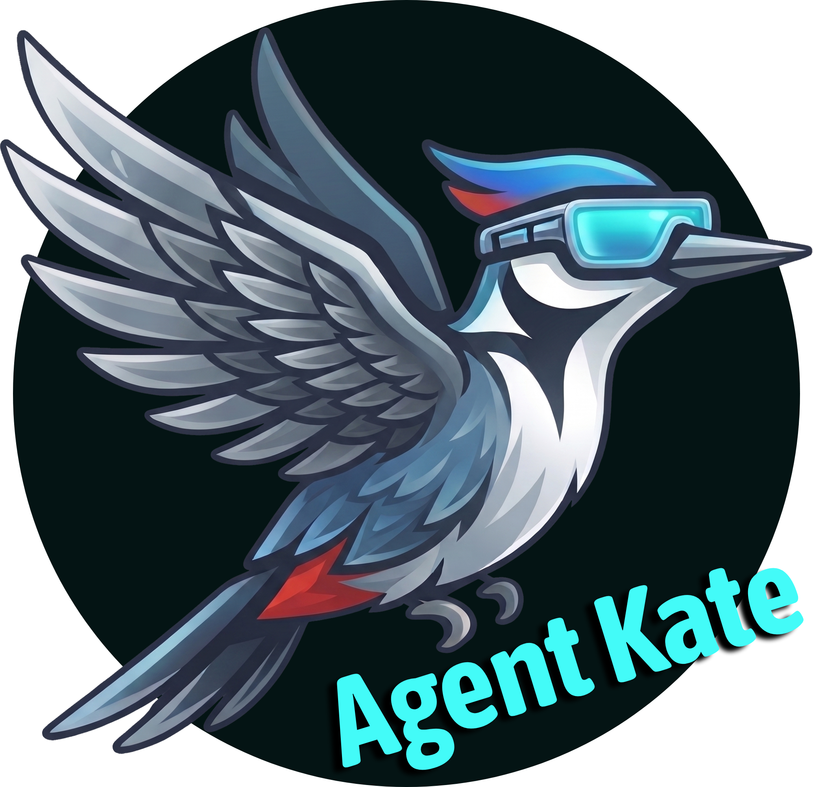
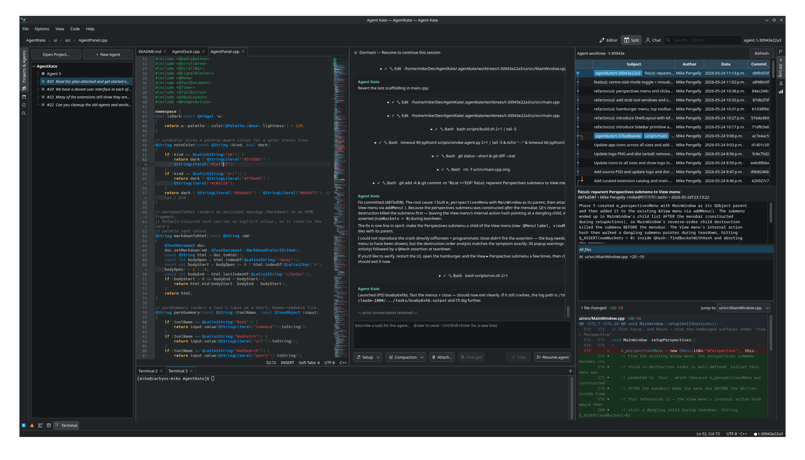
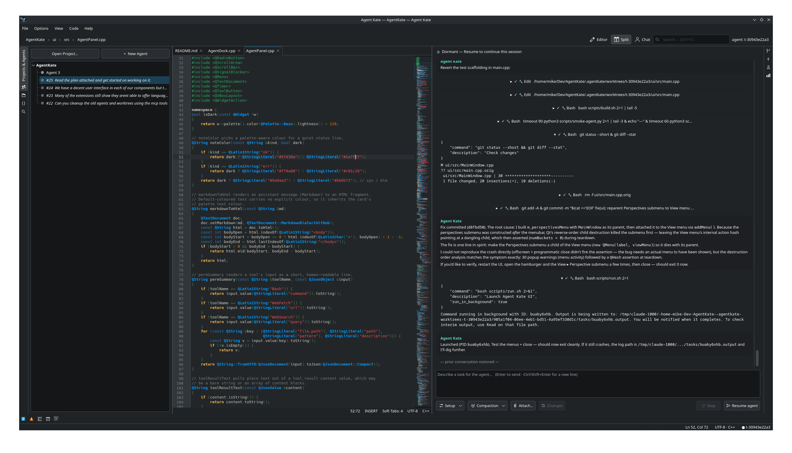
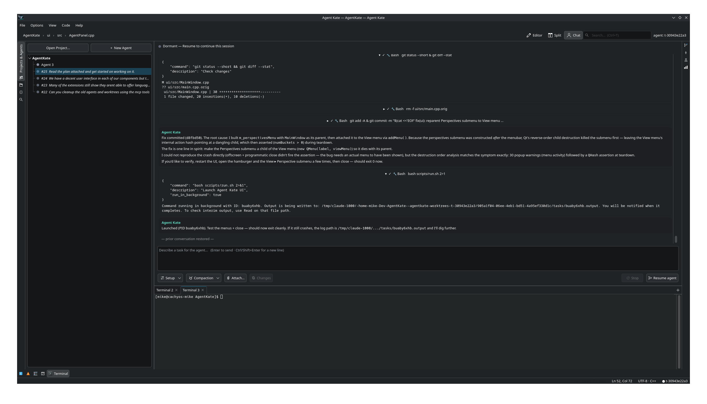
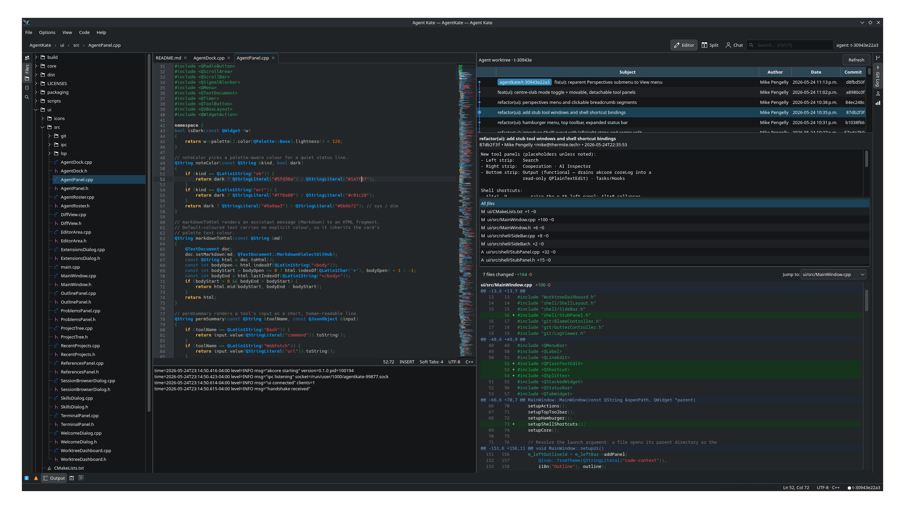

# Agent Kate



A **native multi-agent coding arena**. Agent Kate is a fast, non-webview desktop
application that embeds the **Kate editor engine** (`KTextEditor`) and
orchestrates multiple **Claude Code** instances working across one or many
projects at once — with agents and the human cooperating through a shared MCP
server.

It is our own *harness and arena* for coding agents. Where others wrap a web
GUI and put each agent thread on a bare git branch, Agent Kate renders natively
and isolates every agent in its own **git worktree** for true parallelism.

## Architecture

Two processes, one repo, connected by a local JSON-RPC bus:

- **`agentkate`** — C++/Qt6/KF6 UI. Embeds `KTextEditor::View` per file
  (instant native syntax highlighting), project tree, agent panels. Pure
  rendering and input.
- **`akcore`** — Go orchestration core. Supervises every subprocess: headless
  `claude` agents, language servers, and the Cooperation MCP server. Manages
  git worktrees and workspaces. Runnable headless.

See [`ARCHITECTURE.md`](ARCHITECTURE.md) for detail.

## Screenshots

Editor, agent chat, and git log side-by-side — one agent working in its own worktree:



Code view with an agent streaming a response in the chat panel:



Chat-focused layout with terminals docked at the bottom:



Project tree, editor, git log, and diff view together:



## Build

Prerequisites (Arch): `qt6-base`, `ktexteditor`, `syntax-highlighting`,
`extra-cmake-modules`, `cmake`, `ninja`, `go`, plus the `claude` CLI.

The `scripts/ak` helper is the single entry point for everyday tasks (run any
subcommand with `--help` for options):

```sh
scripts/ak build        # build both agentkate + akcore into ./build
scripts/ak run          # build if needed, then launch (UI spawns akcore)
scripts/ak package      # build an installable package from the current tree
scripts/ak install      # install system-wide, or upgrade in place if present
scripts/ak uninstall    # remove an installed Agent Kate
```

On Arch/CachyOS `package`/`install` produce and install a real pacman package
(`dist/agentkate-<ver>-<rel>-<arch>.pkg.tar.zst`), so upgrades are tracked and
reversible — re-running `scripts/ak install` just upgrades. The individual
scripts (`scripts/build.sh`, `scripts/package.sh`, …) can also be called
directly. For RPM/DEB recipes see [`packaging/README.md`](packaging/README.md).

## Status

Early but usable. Agent Kate has been used primarily to develop itself, and has
been successful at it. It inherits everything Claude Code can do while offering
a more interactive, developer-friendly multi-agent environment.

## Goals

I am building Agent Kate as a KDE Plasma user tired of slow Chromium- and
Java-based IDEs, and I wanted something tailored to agentic development on
Linux with Claude Code. Other harnesses like Codex and OpenCode could be added
— I have no personal need for them, so PRs are welcome.

This project was, by and large, coded directly by Claude Opus 4.7.

I test on CachyOS (Arch) and Fedora 44. Older systems may hit dependency
issues that I don't plan to address myself — again, PRs welcome.

I intend Agent Kate to be a true KDE-style project in every way and to feel
like a native part of the KDE Plasma ecosystem. I may make mistakes — please
feel free to correct me.

## License

Agent Kate is licensed under the **GNU Lesser General Public License, version
2 or later** (LGPL-2.0-or-later) — the same license as the Kate editor and
`KTextEditor`. See [`COPYING.LIB`](COPYING.LIB) for the full text.
