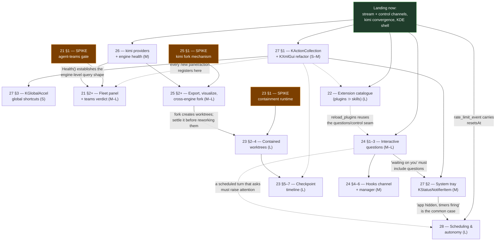

# 20 — Approved features program (the 2026-08 capability-drift round)

**Status: PLANNED.** This is the program doc for the twelve features the user
approved in [`docs/IDEAS.md`](../IDEAS.md). It clusters them into eight
workstreams, sequences them by dependency and risk, and records how each of the
user's inline design notes shapes the design. Every cluster has its own plan
doc (21–28); this file is the map, not the detail.

The three HOLD items (IDEAS #5 live workspace-diff, #6 `claude ultrareview`,
#14 first-run tour) are **out of scope** and stay listed in IDEAS.md untouched.

IDEAS **#15** (extended timer and resume support) was added and approved while
this program was being written. It is folded in as
[plan 28](28-scheduling-and-autonomy.md) rather than left dangling — it is a
major approved feature and it interlocks with three items already here
(`rate_limit_event`, the tray, and the Jobs panel).

## What this program is built on

Four bodies of work land immediately before it, and every plan here assumes
them as existing substrate rather than re-planning them:

| Landing now | What the program gets for free |
|---|---|
| **Claude stream channel** — `--include-partial-messages`, full system-subtype dispatch (`compact_boundary`, model fallbacks, `api_error`…), `rate_limit_event`, `--forward-subagent-text` | A real dispatch **table** at `AgentPanel::applyEvent` instead of the `if (subtype != "init") return;` early-out. Plans 24 (questions, hooks) and 21 (fleet) add rows to that table rather than inventing a second dispatcher. |
| **Claude control channel** — `get_context_usage` meter, `list_models` discovery, `set_max_thinking_tokens`, `reload_skills`, launch options (`manual`/`dontAsk`, `--strict-mcp-config`, `--max-budget-usd`, `--name`) | A shared `Supervisor.control(threadID, subtype, params) → (response, error)` helper. Plan 22 rides it for `reload_plugins`; plan 24 rides it to answer `request_user_dialog`. `--name` is the hard prerequisite for plan 21 (without it an AgentKate thread is anonymous in `claude agents --json`). |
| **Kimi** — real in-session `/compact`, `config_option_update` → UI convergence, `/usage` context, `session/load` browse-resume, command-membership gating | Kimi is no longer the engine that silently drops mid-session truth. Plans 24, 25 and 26 can assume the translator has a `config_option_update` path and a `session/load` replay path to extend. |
| **KDE shell** — `KNotification` + `notifyrc` (`ui/src/notify/AgentNotifier.*`), `KDBusService` unique instance + argv forwarding, window-geometry restore, xdg-activation raise path | Plan 27's tray item is a *second consumer* of `AgentNotifier`'s already-tested decision layer, and its click-to-raise reuses the activation path `KDBusService` established. |

**Not landed, and a hard prerequisite:** the KActionCollection / KXmlGui
shortcut refactor. IDEAS #13 (global shortcuts) cannot be built without it —
`KGlobalAccel::setGlobalShortcut` takes a `QAction` that belongs to a
collection. It is folded into plan 27 as **Phase 1**, and it is the first thing
this whole program should do (see *Execution order*).

## The eight clusters

| Plan | Cluster | IDEAS items | Size | Spike first? |
|---|---|---|---|---|
| [21](21-fleet-and-agent-teams.md) | **Fleet & topology** — adopt the machine's other agents; decide the multi-agent protocol question | 1, 2 | L | **Yes** — #2 is a gated experiment |
| [22](22-extension-catalogue.md) | **Extension catalogue** — one granular, cross-engine model that subsumes Skills | 3 | L | No |
| [23](23-contained-worktrees-and-checkpoints.md) | **Contained worktrees & checkpoints** — stop agents escaping; make every turn restorable | 4 | XL | **Yes** — containment runtime choice |
| [24](24-agent-questions-and-hooks.md) | **The interaction channel** — agents asking the user; hooks visible and per-agent | 8, 7 | L | No |
| [25](25-session-portability-and-fork.md) | **Session portability & fork** — export, visualize, and cross-engine fork | 10 | M–L | **Yes** — kimi fork mechanism |
| [26](26-engine-services.md) | **Engine services** — kimi provider registry, preflight health for both engines | 9, 11 | M | No |
| [27](27-kde-presence.md) | **KDE presence** — action collection, system tray, global shortcuts | 12, 13 | M–L | No |
| [28](28-scheduling-and-autonomy.md) | **Scheduling & autonomy** — persistent timers, rate-window auto-resume, gated agent-requested schedules | 15 | L | No |

Size key matches `README.md`: **S** ≈ <½ day, **M** ≈ 1–2 days, **L** ≈ 3–5
days, **XL** ≈ a release of its own.

### Why these groupings

- **21 (1 + 2) — one topology question, two halves.** IDEAS #1 asks "show me
  agents I did not start"; #2 asks "should our multi-agent model *be* the CLI's
  multi-agent model". They share one substrate: `claude agents --json` is how a
  native team's members would become visible, and a team coordinator's workers
  are exactly the `kind: "background"` rows the fleet view renders. Answering #2
  first also decides how much of plan 16's orchestration layer survives, so it
  must not be planned in a different doc from the surface that would display it.
- **22 (3) alone.** The plugin model absorbs `core/internal/skills` wholesale.
  It touches no other cluster and nothing else should touch it mid-flight.
- **23 (4) alone.** The user's note turns this from "add checkpoints" into
  "rework the worktree system so agents cannot escape it, *then* add
  checkpoints". That is the largest single item in the program and the only one
  that changes where every agent process runs.
- **24 (8 + 7) — the two channels AgentKate drops.** Both are events the CLI
  already emits into a dispatcher that discards them, both need to reach the
  user when their panel is *not* on screen (so both land in `AgentNotifier` and
  the tray), and both need a harness-neutral seam because the answer/enable path
  differs per engine. Questions is the hero and ships first; hooks is the same
  machinery pointed at a different subtype family.
- **25 (10) alone.** The user's note makes export the *vehicle* for fork, not
  the goal. Both are per-thread session lifecycle; both add one harness method.
- **26 (9 + 11) — engine-level, not thread-level.** Providers and health are
  the two things you ask an *engine* before you have a thread. Both surface in
  the same place (the New Agent dialog's engine picker), and both want the same
  new harness shape: a query that takes no `threadID`.
- **27 (12 + 13) — one action model.** The tray menu and the global shortcuts
  must be built from the *same* `KActionCollection`, or the tray grows a second
  parallel action list that drifts. Doing the collection refactor once, first,
  serves both.
- **28 (15) alone, but downstream of three others.** Scheduling consumes
  `rate_limit_event` (landing now), needs the tray (27 §2) for the common case
  of "app hidden, timers firing", and hosts its Timers view in the Jobs panel
  (plan 19). It is its own workstream because the hard part is neither the timer
  loop nor the UI — it is the authority rule, which touches nothing else.

## Dependency graph

Solid arrows are hard dependencies. Dotted arrows are *conventions* — work that
is not blocked, but that will need retrofitting if done in the wrong order.

## Recommended execution order

**0. Plan 27 §1 — the KActionCollection / KXmlGui refactor. Do this first.**
Not because global shortcuts are urgent, but because five of the seven clusters
add new user-visible actions (a Fleet panel, an Extensions panel, a checkpoint
rail, an Answer-question action, Export/Visualize menu items). Every one of
those actions should be born inside the collection. Doing the refactor after
them means touching all five again, and each one added outside the collection is
another `setShortcut` that cannot be reconfigured and another command the palette
cannot see. It is S–M and it unblocks 27 §3 completely.

**1. Run the three spikes concurrently, immediately.** They are read-only
investigations, they do not touch the tree, and each one can change the shape of
its plan:

- **21 §1** — is `CLAUDE_CODE_EXPERIMENTAL_AGENT_TEAMS` a protocol we can
  depend on, or a gate that could vanish next release? The verdict decides
  whether plan-16's orchestration MCP tools stay the model or become a
  compatibility shim.
- **23 §1** — bubblewrap vs. systemd-nspawn vs. podman vs. landlock-only vs.
  the CLI's own `--add-dir`. The verdict decides the substrate every agent
  process runs on.
- **25 §1** — how does a kimi thread fork, given that `session/fork` is
  **not implemented** on 0.30 (probed; see plan 25)? The verdict decides whether
  fork becomes a real cross-engine capability or an honest per-engine downgrade.

**2. Plan 24 §1–3 — interactive questions.** The user called this "much needed
for all agent types" and it is the highest value-per-line item in the program.
Its dependency (the system-subtype dispatch table) lands with the current work,
and the kimi half is already fully specified from a live probe. Ship questions
before hooks.

**3. Plan 26 — engine services.** Small, low risk, and it establishes the
engine-level (thread-less) harness query that plans 21 and 25 both want. Runs in
parallel with 24: different files entirely (`NewAgentDialog` / `ProvidersDialog`
vs. `AgentPanel`'s transcript).

**4. Plan 25 — session portability and fork.** Adds `ExportSession` to the
harness interface and closes the claude-vs-kimi fork gap. Must land *before* 23
starts reworking worktrees, because fork is a worktree creator
(`worktree.CreateFrom`) and the containment rework changes what creating one
means.

**5. Plan 22 — the extension catalogue.** Large but independent. Slots in
whenever a person is free after step 0; scheduled here because it is the least
coupled thing in the program and therefore the best parallel track.

**6. Plan 23 — contained worktrees, then checkpoints.** The program's XL item,
started once its spike verdict is in and fork has settled. Containment
(§2–4) must land before the checkpoint timeline (§5–7): a checkpoint is only
meaningful if the agent could not have written outside the tree being
checkpointed.

**7. Plan 21 §2+ — the fleet panel**, plus whatever the teams verdict committed
us to. Late because adopting a foreign session is most useful once the things
you would *do* to it (export, fork, checkpoint, contain) exist.

**8. Plan 27 §2–3 — tray and global shortcuts.** The tray's aggregate state
("N running / M waiting on you") is only complete once questions (24) exist to
be waited on. It can ship earlier with permission-queue attention only and gain
question attention later — so if a person is free, this is a legitimate parallel
track from step 2 onward.

**9. Plan 28 — scheduling and autonomy.** Last, and deliberately so: its common
case is "the window is closed and timers still fire", which the tray (27 §2)
supplies, and a scheduled turn that hits a question needs plan 24's surface to
land in. Its Phase 2 (rate-window auto-resume) is the exception — it depends
only on `rate_limit_event`, which is landing now, and it is the single
highest-value piece of the plan. **If the program needs an early win, pull plan
28 Phase 2 forward on its own;** it is small, it is self-contained, and it turns
every rate-limit stall from "wait for a human" into "resumes at 14:37".

### Parallel tracks (for more than one person)

| Track | Plans, in order | Primary files | Conflicts with |
|---|---|---|---|
| **Shell** | 27 §1 → 27 §2 → 27 §3 | `ui/src/MainWindow.*`, new `ui/src/shell/TrayPresence.*` | nothing (after §1 lands) |
| **Engine** | 26 → 25 → 22 | `core/cmd/akcore/harness_*.go`, `core/internal/harness/`, dialogs | Workspace track at `worktree.go` |
| **Interaction** | 24 §1–3 → 24 §4–6 | `ui/src/AgentPanel.cpp` dispatch, `core/internal/kimi/thread.go` | Fleet track at `AgentPanel` |
| **Workspace** | 23 §1 → 23 §2–7 | `core/internal/worktree/`, new `core/internal/contain/`, new checkpoint panel | Engine track at `worktree.go` |
| **Fleet** | 21 §1 → 21 §2+ | new `core/cmd/akcore/fleet.go`, new `ui/src/FleetPanel.*` | Interaction track at `AgentPanel` |
| **Autonomy** | 28 §2 (early, standalone) → 28 §1, §3–5 | new `core/internal/schedule/`, `ui/src/JobsPanel.*` | Shell track at the tray (consumes it, does not edit it) |

The two real collision points are `worktree.go` (Engine's fork work vs.
Workspace's containment rework — resolved by ordering 25 before 23) and
`AgentPanel.cpp` (Interaction's dispatch rows vs. Fleet's adoption UI —
resolved by keeping the fleet's UI in its own panel and touching `AgentPanel`
only for the "adopt into this panel" entry point).

## How each user note shapes its design

The user annotated five of the eleven items. These are not preferences to
honour loosely — each one changes the design materially, and the plan doc that
does not reflect it is the wrong plan.

### #3 plugins — *"should encompass the existing Skills functionality and take a more granular and cross-agent-compatible approach"*

Three consequences, all in [plan 22](22-extension-catalogue.md):

1. **Subsume, do not sit beside.** `core/internal/skills` becomes
   `core/internal/extensions`; the `skills.*` RPCs survive one release as thin
   aliases and `SkillsDialog` is replaced, not supplemented. Two catalogues
   competing for "where is my setup" would be worse than the one we have.
2. **Granular means the *component* is the unit, not the bundle.** A plugin is
   a bundle of components (skill / command / subagent / hook / MCP server);
   a "skill" is the degenerate one-component case. The user picks components,
   not packages, and the per-agent selection is a component set. This is what
   makes `claude plugin details`'s projected token cost actionable — you can
   drop the two commands you never use instead of the whole plugin.
3. **Cross-agent compatibility is per-component-kind, capability-gated.**
   Claude takes all five kinds (`--plugin-dir`, `--plugin-url`,
   `reload_plugins`). Kimi takes **skills only, and not by flag**: probed,
   `kimi acp` accepts no options but `--login`, so component delivery for kimi
   goes through the per-thread `KIMI_CODE_HOME` (`StartSpec.Env`, already
   shipped) with `extraSkillDirs` written into that home's `config.toml`. The
   capability is a *list* — `ExtensionKinds []string` — not a bool, so the
   picker greys out the four kinds kimi cannot take instead of hiding the panel.

### #4 checkpoints — *"an opportunity to improve and rework the Worktree system… Currently it is escapable and agents have gotten confused. I think maybe we can run the agents inside a linux terminal container… without being given a deliberate path and hatch"*

Three consequences, all in [plan 23](23-contained-worktrees-and-checkpoints.md):

1. **Containment is the feature; checkpoints are what containment makes safe.**
   The plan leads with the worktree rework and puts the timeline second, because
   restoring a tree the agent could write outside of is a false promise.
2. **The containment options are evaluated on their merits and one is
   recommended.** Plan 23 §1 is a spike over bubblewrap, systemd-nspawn, podman,
   landlock-only, unshare-only, and the CLIs' own `--add-dir`, scored against
   six criteria (does `cd ..` actually fail; does Cowork still work; does git
   still work through a worktree's `.git` *file*; startup cost; does it survive
   without root; does it work for both engines). The plan's standing
   recommendation, to be confirmed or overturned by the spike, is
   **bubblewrap as the default `contained` tier** — no daemon, no image, an
   unprivileged user namespace (this box: `unprivileged_userns_clone=1`,
   `max_user_namespaces=127807`), and the property that matters most for
   "agents have gotten confused": the wrong paths do not *exist* inside the
   sandbox rather than merely being denied.
3. **"Deliberate path and hatch" becomes two named primitives.** A **path** is a
   declared extra bind mount recorded on the thread record (visible, persisted,
   replayed on resume). A **hatch** is an agent-requested path, granted by the
   human through the same consent dialog `enable_cowork` uses — and, because a
   bind mount cannot be added to a live namespace from outside, granting one
   re-attaches the thread through the machinery plan 18 already built for kimi.

### #8 interactive questions — *"much needed feature for all agent types that can support it"*

The phrase *"all agent types that can support it"* is a capability gate, and
[plan 24](24-agent-questions-and-hooks.md) makes it one: a new
`Capabilities.InteractiveQuestions` plus a `Harness.AnswerQuestion` method, with
per-engine translation and no engine `if` in the UI. Both engines can support
it, by different routes:

- **Claude** — the `request_user_dialog` and `side_question` system subtypes
  (78 and 25 references in the 2.1.220 bundle), answered back over the control
  channel; `--brief` enables the `SendUserMessage` tool for the unprompted
  direction.
- **Kimi** — no separate method exists, and its ACP adapter says so in its own
  source: *"ACP currently has no dedicated `session/request_question` method, so
  the adapter re-uses `requestPermission` and tags the options with a `q{n}_*`
  namespace"*. A question therefore arrives as an ordinary
  `session/request_permission` whose `toolCall.title` is `"AskUserQuestion"` and
  whose options are `q0_opt_<i>` (kind `allow_once`) plus a trailing `q0_skip`
  (kind `reject_once`). That is a complete, unambiguous detection and answer
  rule, extracted from the shipped binary and recorded in plan 24.

### #9 kimi providers — *"use this as an option while still having first class support for using claude code with other providers"*

[Plan 26](26-engine-services.md) treats kimi's registry as a **second kind** of
provider routing, not a replacement. Plan 11's env-injection routing
(`agent.buildEnv`, `Capabilities.ProviderRouting`) is untouched and stays the
Claude story; kimi gets a new `Capabilities.ProviderRegistry` because the
mechanism is genuinely different — a persistent registry in the engine's home
directory, not per-launch environment. `ProvidersDialog` gains a second section
rather than a rewritten one, and the two are composable: a kimi thread's
registry lives in its own `KIMI_CODE_HOME`, so two kimi agents can target
different provider sets in the same project.

Also settled by probe, and it shapes the plan: `providers/list` is **not
implemented** over `kimi acp` (`-32601 Method not found` on 0.30.0), so the
registry is managed by shelling out to `kimi provider list --json` /
`add` / `remove` with `KIMI_CODE_HOME` set — not over the live ACP connection.

### #10 export — *"we can use this to implement a Fork system as well since that's currently a gap with Claude vs Kimi"*

[Plan 25](25-session-portability-and-fork.md) is written fork-first: export is
one harness method (`ExportSession`), and fork is what the same session-copying
machinery buys. The gap is real and now precisely measured:

- **Claude** already forks (`--fork-session`, wired at
  `harness_claude.go:234`), and has **no** `export` subcommand — so
  `ExportSession` for claude is a core-side bundler over
  `session.ReadTranscript` + the attachment store + the thread record.
- **Kimi** already exports (`kimi export [sessionId] -o out.zip`) and
  visualizes (`kimi vis`), and **cannot** fork: probed live, `session/fork` is
  in the ACP SDK's method table but returns `-32601 Method not found` on kimi
  0.30.0. Plan 25 §1 is the spike that decides between copy-the-session-dir,
  export-and-replay, and summary-seeded, with an honest downgrade as the
  documented fallback rather than a fake fork.

### #15 scheduling — *"the workaround… is exactly the kind of ungated self-escalation that permission classifiers rightly block"*

IDEAS #15 has no separate note because the whole item is one, and its last
clause is the design constraint rather than an aside.
[Plan 28](28-scheduling-and-autonomy.md) is built around a single rule stated at
the top of the scheduler package: **a scheduled action never has more authority
than the human granted the thread.** Concretely — a scheduled resume launches
with the record's persisted `PermissionMode` and there is no code path that can
construct an override (enforced by a source-level test, not a comment); a
scheduled turn that hits a permission prompt blocks and raises attention exactly
as an interactive one does; and an agent may *request* a schedule through the
`enable_cowork` consent pattern but only a human may *create* one.

That is what makes this feature legitimate where the systemd-plus-
`bypassPermissions` workaround is not: the capability is the same, the gate is
kept.

## Conventions every plan in this program must hold

Repeated here because they are the ones this particular set of features is most
likely to break:

- **KDE-native.** The Midnight signature theme is palette-only on Breeze
  (`ui/src/theme/ThemeManager.cpp`). No Fusion, no app-wide QSS. New panels
  (Fleet, Extensions, Checkpoints) get their colours from `KColorScheme`.
- **Documented CLI surface only.** Claude integration uses documented flags,
  control requests and events. Anything read out of the bundle — the agent-teams
  gate, the `AskUserQuestion` option namespace — is a *spike input*, and shipping
  on it requires a feature flag and a written fallback story. Nothing
  undocumented may be load-bearing.
- **The harness registry is the seam.** Cross-engine features get a harness
  interface method plus per-engine capability gating. No `backend == "kimi"`
  outside an adapter. This binds features 8, 10, 11 and the kimi half of 3.
- **Applied truth, never requested truth.** Every new launch option follows the
  `Launched.UnappliedOptions` pattern: a request the harness could not express is
  reported with a reason, never silently dropped.
- **Flicker rule.** Anything that repaints goes through `Reactive<T>` with
  equality guards (`ui/src/state/Reactive.h`). The Fleet panel polls
  `claude agents --json` on a timer — that is exactly the shape that produced the
  git-tree flicker, and it must publish only on change.
- **Chip rows and long labels** use `FlowLayout` / `ElidingLabel`
  (`ui/src/shell/`). The extension component picker and the checkpoint rail are
  both chip-shaped.
- **Async IPC callbacks never capture raw `this`.** `QPointer` guard or a
  weak-ref idiom on every `CoreClient::call` continuation — this is the
  documented root cause of the app's SIGSEGV class.
- **Transcript volume.** Anything that adds rows (hook events, question cards,
  checkpoint markers) must pass through the existing 5000-row / 128 KB-per-result
  trimming, not around it.

## Non-goals for the whole program

- The three HOLD items (#5, #6, #14). Not planned, not started, still listed.
- Re-planning the work described in *What this program is built on* — those
  land independently and these plans consume them.
- ~~A second multi-agent model.~~ *(Superseded by the user's answer to open
  question 2, 2026-08-01: BOTH systems stay first-class — plan 16's MCP
  orchestration as the cross-engine/cross-provider bridge, the CLIs' native
  teams for same-engine context-sharing topologies. The spike now decides
  integration quality, not either/or.)*
- Windows/macOS containment. Plan 23 is Linux-only by construction (user
  namespaces, landlock, bind mounts) and says so.

## Open questions for the user

These are collected from all seven plans; each is repeated in context in its own
doc. They are the decisions that cannot be made from the code.

1. **Containment default (plan 23).** Should `contained` become the *default*
   isolation tier for new agents — replacing today's "Isolated worktree"
   checkbox default — or ship as a third opt-in tier beside `auto` /
   `isolated` / `workspace` for a release first? Defaulting it fixes the
   reported confusion for everyone; opting in avoids surprising a user whose
   agent suddenly cannot reach `~/.config`.
   
   **Answer**: It should be a 4th, default option. Infact if we use a podman system in the future, we could have 5 tiers. 
   
2. **Agent-teams commitment (plan 21).** If the spike shows the native teams
   protocol is usable, do we adopt it and reduce plan 16's orchestration tools
   to a compatibility shim, or keep our own model as the primary and treat teams
   as an import path? This is a strategic call, not a technical one.
   
   **Answer**: I would like to maintain first class support for both systems. Our Tools are more for bridging between Agent Types and Providers, where as the native tools in Claude Code and Kimi Code are more tailored to their abilities to cross spawn and reuse context so its a situational call as to which on works better. 
   
3. **Kimi fork downgrade (plan 25).** If none of the three fork mechanisms
   works, is a *summary-seeded* fork (new session, compaction summary as the
   seed — lossy, and honestly labelled) acceptable for kimi, or should Fork stay
   capability-gated off there?
   
   **Answer**: Summary seeded Fork is a great and acceptable solution and should be presented as an option in other scenarios as it could be preferred even when a native fork is possible. 
   
4. **Hook trust boundary (plan 24).** Per-agent `--settings` means an agent's
   hooks can run arbitrary commands. Should AgentKate let a *thread* be launched
   with a settings overlay the user picked, only from a vetted list, or not at
   all — and should `--setting-sources` default to excluding project settings
   for a worktree the user has not opened before?

   **Answer (recorded 2026-08-01, discussed with the user): "screened trust."**
   (a) Overlays come from a vetted registry: adding one shows exactly which
   hooks/commands it contains, reviewed by an **isolated screening agent** — a
   one-shot headless `claude -p` (Sonnet for rare config review, Haiku-tier for
   frequent calls), no tools, fresh context containing only the artifact under
   review wrapped as untrusted data (never the thread transcript), JSON verdict
   {allow/deny/ask + risk summary}, rules-first with the model only for the gray
   zone, verdicts cached, **fail closed** to asking the user. (b)
   `--setting-sources` defaults to excluding project settings until first
   explicit per-repo trust; the trust dialog shows the screener's plain-language
   risk summary of the repo's hooks so the decision is informed, with a visible
   "project settings suppressed — review & trust" banner (never silent), and
   trust inherited by that repo's worktrees. Opt-in "auto-trust benign verdicts"
   for low-friction personal use. (c) For Claude threads, the CLI's native
   `auto` permission mode (already exposed in the mode lists) covers tool-call
   screening; the akcore screening service additionally provides a per-thread
   **"Screened auto"** mode for kimi threads, closing that capability gap
   engine-agnostically behind the harness seam. Free-form overlays remain
   available behind an advanced toggle. Details: plan 24 §7.
   
5. **Extension scope granularity (plan 22).** Claude installs plugins at
   `user` / `project` / `local` scope. Should AgentKate's per-agent component
   set be a *fourth*, purely session-scoped concept (`--plugin-dir` per thread),
   or should selecting components for an agent also install them at project
   scope so the user's own terminal sessions see them too?
   
   **Answer**: I believe a purely temporary session based concept would give Agent Kate the absolute control which is what is desired. 
   
6. **Standing self-schedule grant (plan 28).** A per-thread, default-off *"this
   agent may schedule its own continuations"* toggle is what makes a genuinely
   unattended multi-hour program possible — otherwise every hourly continuation
   prompts a human who is not there. Is a standing grant acceptable, or must
   every schedule be individually approved?
   
   **Answer**: Agents should not be limited to how they schedule. However the user should have visibility of everything schedules and have controlls to prevent them from running all together or by project or agent. The controls are invisible to the agent, but are hard switches in the event scheduler. 
   
7. **Lingering (plan 28).** Timers fire while logged out only with
   `loginctl enable-linger $USER` (currently `Linger=no` on this machine), which
   changes the user's session policy machine-wide. Explain and offer the command,
   offer to run it, or never mention it and mark affected timers as
   app-must-be-open?
   
   **Answer**: The user should be required to be logged in and agent kate must run on active desktop and displayed to perform scheduled tasks. Nothing should be run hidden from the user or without real time visibility
   
